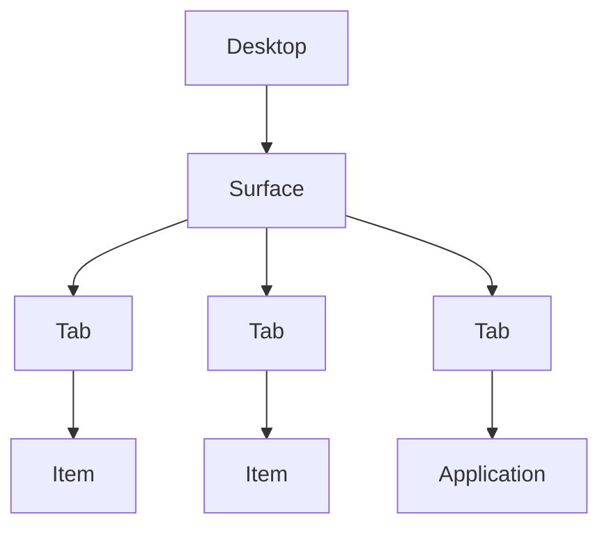

# Echo OS Web

Echo OS는 웹 브라우저에서 직접 사용해볼 수 있는 **Concept OS**입니다.

실제 커널을 구현하는 운영체제가 아니며, 기존 데스크톱 OS의 사용 방식을 다시 설계해보고 그 가능성을 실험하기 위한 프로젝트입니다.

## 핵심 질문

> Application 중심이라는 기존 전제를 내려놓고, 사용자 작업 중심으로 OS가 다시 설계된다면?

통상적으로 기존의 OS는 Application이 전용 Window를 소유하는 방식이었습니다. Echo OS는, **사용자가 수행하려는 작업을 중심으로 사고하도록 유도하는 것**을 실험합니다.

## 핵심 개념

Echo OS는 Application마다 전용 Window를 만드는 구조 대신 **Surface**라는 작업 공간을 중심으로 동작하는 방식을 실험하고 있습니다.

Surface 안에서는 File, Folder, Application과 같이 서로 다른 Item을 하나의 작업 흐름 안에서 Tab으로 다룰 수 있습니다.

Echo OS의 관점은 Application의 제거가 아닙니다. Application은 사용자가 원하는 기능을 제공할 뿐, **사용자가 선택해야 할 대상이 아니다**고 봅니다.

## 진행 상황

현재 프로토타입에는 다음과 같은 기반 기능이 구현되어 있습니다.

- 이동·크기 조절·최소화·최대화·닫기가 가능한 Window System
- Taskbar와 실행 중 Window 관리
- 간단한 Virtual File System과 Files
- Surface Window와 Surface 내부의 persistent Tab
- 빈 Tab에서 Item / Application을 함께 찾는 Universal Search
- File과 Directory의 Item 실행 및 같은 Surface 내 Item reuse
- 공유 Virtual File System과 Files
- `.txt` Item의 편집 및 저장이 가능한 Text Editor
- 새 Text File 생성
- 편집 중인 Text Tab의 dirty 상태 표시
- 최근 실행한 Item을 보여주는 in-memory Recent
- Recent가 없을 때 표시되는 Suggested
- Files의 현재 Directory에 따라 Tab identity가 바뀌는 Item-oriented identity 실험

## 로드맵

Echo OS는 현재 기능을 **구현 → 직접 사용 → 문제 발견 → 필요한 추상화 추가** 순서로 발전시키고 있습니다.

### 1차 로드맵 — 기반 구조와 Surface 모델 정립 (완료)

- **Phase 1 — Desktop과 Window System**
- **Phase 2 — Window 관리와 Taskbar**
- **Phase 3 — Virtual File System과 Files**
- **Phase 4 — Universal Search와 Item 실행**
- **Phase 5 — Surface 도입**
- **Phase 6 — Persistent Surface Tab 모델**

### 2차 로드맵 — 실제 작업성과 Surface 확장 (진행 중)

- **Phase 7 — 실제 작업 능력**: Shared VFS, Text Edit/Save, Item CRUD를 통해 Surface 안에서 실제 작업이 가능하도록 만듭니다. 현재 이 단계의 후반부이며, New Folder와 Delete가 주요 남은 항목입니다.
- **Phase 8 — Tab을 작업 단위로 강화**: Tab reorder 등, Tab 자체를 더 완전한 작업 단위로 만드는 기능을 검증합니다. 필요성이 먼저 발견된 Target Back history는 이미 구현했습니다.
- **Phase 9 — Surface 경계 상호작용**: Surface 간 Tab Drag & Drop과 tear-off처럼, 사용자가 명시적으로 Surface 경계를 넘는 상호작용을 실험합니다.
- **Phase 10 — 작업 Context 지속성**: Surface rename, Surface/Tab 상태 persistence, 필요 시 Recent persistence를 추가합니다.

AI, Split View, 별도 Workspace 계층, 범용 Capability/Handler framework, 실제 파일 시스템/OPFS 전환 등은 3차 로드맵 이후로 미뤄두고 있습니다.

## 최종 목표

Echo OS의 목적은 기존 OS보다 절대적으로 우월한 방식을 증명하는 것이 아닙니다. 다음과 같은 질문을 **구동되는 프로토타입을 통해 직접 검증하는 것**이 목적입니다.

- Application보다 Item을 먼저 선택하는 방식이 자연스러운가?
- 서로 다른 작업 대상을 하나의 Surface 안에서 다루는 것이 유용한가?
- Surface라는 작업 Context의 경계가 이해 가능한가?

## 데모

[Echo OS Web - Vercel](http://echo-os-web.vercel.app/)
